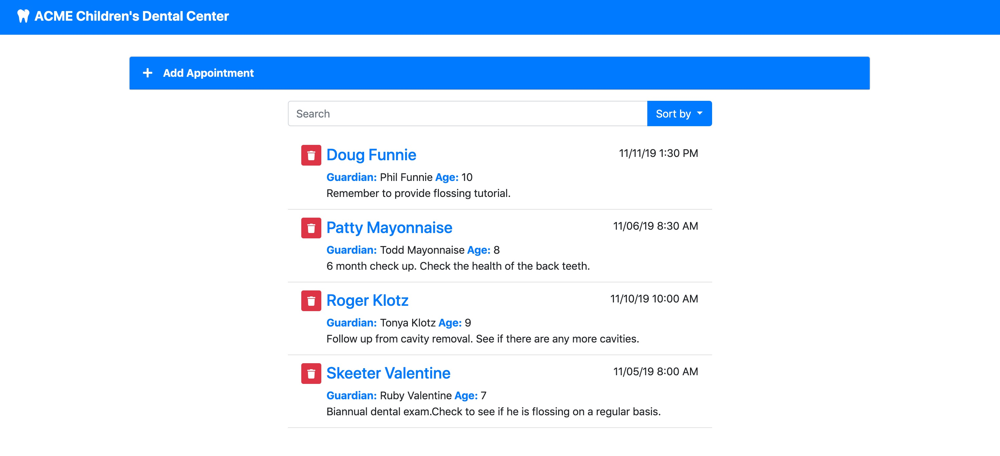

# Appointment Setter



A fully functioning appointment setter for a mock children's dentist built in Vue.js. There is a built in 2 second delay to present the loading state of the appointment list. You have the ability to create and update appointments instantly. The appointment list has the contenteditable attribute activated and will update the state of the appoinment list automatically. There is also a delete feature with a modal confirmation with the name and date of the selected patient appointment.

## Prerequisites

Please make sure you have Node.js installed. You can find the link to download Node.js [here](https://nodejs.org/en/)

```javascript
// Verify Node was installed by running this command in your terminal
node -v
// You should get something like...
v12.8.1 // it may be a higher version number than this
```

## Getting Started

After downloading this repo, go to your terminal and install all the dependencies first.

```
npm install
```

## Running Your Build

**Compiles and hot-reloads for a development environment**
```
npm run serve
```

**Compiles and minifies for a production environment**
```
npm run build
```

## Runnning Your Tests
```
npm run test
```

## Linting 
```
npm run lint
```

## Built With

* [Vue.js](https://vuejs.org) - The front-end framework used
* [Bootstrap](https://getbootstrap.com) - Used to style the components
* [date-fns](https://date-fns.org) - Used to format the date
* [fontawsome](https://fontawesome.com/start) - Used to generate FontAwesome Icons in component form
* [axios](https://www.npmjs.com/package/axios) - Used to make Promise based HTTP requests

## Versioning

We use [SemVer](http://semver.org/) for versioning. For the versions available, see the [tags on this repository](https://github.com/your/project/tags). 

## Authors

* **Adam Abundis** - *Initial work* - [Abuna1985](https://github.com/Abuna1985)

## License

This project is licensed under the MIT License - see the [LICENSE.md](LICENSE.md) file for details

## Acknowledgments

* [Ray Villalobos](https://github.com/planetoftheweb) - Lynda course [Vue.js: Building an Interface](https://github.com/planetoftheweb/vue-interface)
* [PurpleBooth README.ME project example]- (https://gist.github.com/PurpleBooth/109311bb0361f32d87a2)

## Customize Vue.js Configuration
See [Configuration Reference](https://cli.vuejs.org/config/).